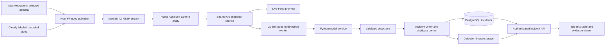

# FireMeX supervisor demonstration: camera to incident

Prepared 6 October 2026. **Planning only: the pipeline has not been implemented or tested by writing this document.** This focused milestone precedes the broader product roadmap and reuses its camera, detection and incident work rather than creating a throwaway application. User decisions are recorded in [project memory](docs/product-decisions.md).

## 1. Demonstration outcome

The supervisor sees a live MacBook camera feed in FireMeX. Fire/smoke imagery presented to that camera is sampled by the backend and analyzed by the team's actual model. A qualifying detection produces a real PostgreSQL incident, with camera name, zone, timestamp, class, confidence and an evidence image. The incident appears automatically in the existing Incidents screen and remains after a page reload or backend restart.

Also support a selected USB/virtual camera exposed by macOS and a prerecorded video published through the same camera ingestion path. These are explicit supported demo inputs, not a guarantee that every computer video source works. Begin with the M2 webcam; expand to approximately four independently named sources for scheduling tests. Do not hard-code four as a product limit.

The demo establishes that the integration works with the current model. It does not establish reliable detection of all real fires. Use prerecorded footage, including footage displayed on a separate screen for the webcam demonstration; do not create a real fire. Show recorded replay as recorded replay. A model missing an event must remain visible in the test results.

## 2. Architecture and responsibility

FFmpeg captures the source. MediaMTX publishes it for Home Assistant. Home Assistant provides camera images. Go schedules sampling, calls Python and owns event persistence. Python owns model loading, inference and annotations. Preact displays persisted results. Inference runs without a browser being open.

Run FFmpeg, MediaMTX, Go and Python on the Mac for this milestone, alongside the existing development Home Assistant/PostgreSQL setup. Preserve the existing database host-port change. Full add-on packaging and GPU optimization are not prerequisites. Start with a reproducible CPU inference path; benchmark M2 acceleration only if necessary, without assuming pinned package compatibility.

The backend sends sampled images, not the entire encoded video, to the existing `/detect` endpoint. The preview can update more frequently than analysis. Home Assistant documents the camera image endpoint used here: [REST camera proxy](https://developers.home-assistant.io/docs/api/rest/).

## 3. What already exists and what is missing

| Component | Repository evidence | Required work |
|---|---|---|
| Mac webcam setup | `CAMERA_SETUP.md`, `mediamtx.yml.example` | Verify the actual device, permissions, stream and changing snapshots; provide repeatable startup steps. |
| Camera enrollment | Camera model and existing controllers | Reuse organization ownership and `ai_enabled`; add a controlled toggle for existing cameras. |
| Snapshot fetching | `FetchSnapshot` and private `cachedSnapshot` in `backend/controllers/camera.go` | Share this logic with the worker without importing controllers into core services; add cancellation, explicit bounds and timing. |
| Python model | `firemex-model/detect_service.py` | Reuse `/health` and multipart `/detect`; validate request/response and make confidence handling explicit. |
| Incident database | `backend/models/incident.go`, migrated in `backend/main.go` | Add a real writer and read APIs; small additive fields for traceability/evidence lifecycle as needed. |
| Incident UI | `frontend/src/pages/admin/Incidents.tsx` | Replace `initialIncidents` fixtures and local-only updates with authenticated persisted data. |
| Background monitoring | None wired into startup | Implement and manage one detector worker process. |

These are source-code findings, not a new runtime verification. The existing model README reports weak fire recall and false positives; the ML teammate should verify which model/version and evaluation results are current.

## 4. Scope and proposed defaults

Required: real webcam ingestion, existing model inference, background sampling, persistent incidents, annotated evidence where available, a working incident table, honest detector health, duplicate suppression, seven-day image expiry and a reproducible demonstration guide.

Keep purchasing, subscriptions, license activation, cloud deployment, full dashboard analytics and physical siren integration in their separate workstreams. The user's siren-above-50% preference is preserved in project memory. It is not required to demonstrate camera → model → incident. An in-app new-incident banner is included; external delivery and the full Alerts page are later work. Mark remaining fixture-based pages as previews.

| Setting | Proposed starting value | Meaning |
|---|---|---|
| Target sample interval | 2 seconds per enabled camera | Best effort with no overlapping work for the same camera; actual rate depends on measured processing time. |
| Model concurrency | 1 request | Fair scheduling across cameras; increase only after measurement. |
| Confidence threshold | 0.50 for fire and smoke initially | Configurable, ML-reviewed integration setting, not a calibrated probability of danger. |
| Incident rule | First qualifying frame | No human confirmation required to save a machine-reported incident. |
| Duplicate window | 60 seconds per organization/camera/class | Continue analysis; suppress repetitive rows for that class during the window. |
| UI refresh | 2 seconds while visible | One request at a time; show API errors and last successful refresh. |
| Evidence retention | 7 days | Applies to image files; metadata retention is a separate decision. |
| Normal one-camera latency aim | At most 10 seconds | Engineering target for agreed positive test clips, not a measured result. |
| Provisional acceptance bound | 30 seconds | From visible event onset to visible row in agreed demo cases. |

Five false alerts/day is a tentative user value. Interpret site-wide only as a proposal until confirmed. A short supervisor demonstration cannot validate a daily rate. Record counts and monitored camera-hours during a separate soak test; discuss a stricter pilot target with operators after baseline measurements.

## 5. Step D0 — Prepare the ML handoff and baseline

- [ ] Record current code state and preserve unrelated modifications; do not reset existing development data.
- [ ] Ask the ML teammate for the intended weights/checksum, class map, recommended threshold(s), package versions, inference input expectations and known limitations. The current repository checksum is `2ab009042ba04827ee1cd1ccb0648832577677334c5fe4927e7c7950f7406c89`; verify it during implementation.
- [ ] Obtain several permissioned fire, smoke and negative clips. Separate preflight examples from held-out demonstration checks; record origins and whether samples were used for training.
- [ ] Run the model on representative frames through the real HTTP endpoint. Record positive results and misses. If direct-frame inference fails, investigate with the ML teammate before debugging camera ingestion.
- [ ] Benchmark inference time and record the M2 machine's available RAM, runtime versions and actual source setup.

**Done when:** the intended model returns structurally valid results on known samples, limitations are recorded, and the starting environment is reproducible. Backend integration does not require the user to retrain the model.

## 6. Step D1 — Prove camera ingestion

- [ ] Enumerate macOS capture devices instead of assuming device index zero. Request normal camera permission through the host application and handle permission denial clearly. FFmpeg documents the AVFoundation device enumeration and selection interface: [device documentation](https://ffmpeg.org/ffmpeg-devices.html).
- [ ] Start the authenticated MediaMTX stream and publish the selected camera. Reuse the existing documented low-latency encoder settings, checking device-supported resolution/frame rate rather than assuming them.
- [ ] Confirm local stream playback, then confirm the Home Assistant camera entity produces successive valid snapshots, then enroll it in FireMeX.
- [ ] Add a separate named prerecorded input using real-time playback and a distinct stream path. Extend MediaMTX's current single-path permissions explicitly; its sample config currently allows only `webcam`. See [MediaMTX publishing documentation](https://mediamtx.org/docs/features/publish).
- [ ] Keep passwords/tokens out of committed files and diagnostic output. Use the existing host/container addressing appropriate to the local setup.
- [ ] Verify at least one changing visual element. Repeated image bytes alone cannot distinguish a static scene from a frozen source; do not declare source freshness proven solely by HTTP 200 responses.

**Done when:** FireMeX shows the actual webcam and the named replay source can be selected without pretending it is live footage. Broader device support is tested device by device. Exact future CCTV compatibility is outside this demo.

## 7. Step D2 — Share snapshots and implement the model client

- [ ] Extract camera image fetching/cache into `backend/internal/cameras/snapshot.go`; controllers and detector share that service. Preserve authentication/organization checks at HTTP boundaries. The worker only processes authorized database camera records.
- [ ] Pass contexts and cancellation through fetch/wait paths. Preserve one upstream fetch per camera at a time and bounded cache lifetime; include receipt time and sample identity. Never relabel a cached receipt as a newly acquired frame.
- [ ] Reject non-images, empty/truncated responses and over-limit payloads. Read up to the limit plus one byte to detect oversize rather than silently accepting a truncated ten-megabyte image. Bound decoded image dimensions too.
- [ ] Create a Go inference client with typed results, a configurable URL and finite request/response limits. Send multipart `image`, `annotate=true` and explicit threshold to `/detect`.
- [ ] Validate finite scores in [0,1], recognized `fire`/`smoke` labels, image-bounded boxes and consistency between `hazard` and valid detections. Treat malformed output as detector error, never “no fire.”
- [ ] Keep Python inference single-flight and model loading once per process. Move blocking inference out of the async event-loop path where needed so health remains responsive. Bound upload bytes/pixels and explicitly apply the requested cutoff inside the model call as well as response validation.

The current wrapper filters after `model(frame, verbose=False)`, leaving model-side confidence filtering implicit. Ultralytics exposes a `conf` argument; pass the intended cutoff deliberately so a lower configured threshold is not silently blocked by upstream filtering. See [prediction arguments](https://docs.ultralytics.com/modes/predict).

**Done when:** a Go integration test can send an actual camera image to Python and receive a valid, bounded response with annotations. Also test no-hazard, corrupt image, invalid response and timeout paths.

## 8. Step D3 — Run monitoring in the backend

- [ ] Start a cancellation-aware worker after database/config initialization and stop it on shutdown. Run only one worker-owning backend instance for this demo; multi-instance leadership belongs to later deployment work.
- [ ] Discover cameras with `ai_enabled=true`, rechecking changes at least every five seconds. Add an admin-only AI toggle. Deletion/disabling cancels pending work; recheck enabled state before saving an in-flight result.
- [ ] Schedule cameras fairly, with one active inference request globally initially and no unbounded frame queue. Acquire the freshest available frame when its turn arrives; missed schedule ticks are skipped rather than replayed later.
- [ ] Track last image receipt, last inference completion, last persistence success, next due time, failure cause and measured duration. Separate “monitoring disabled,” “starting,” “monitoring,” “camera unavailable,” “model unavailable,” “storage error” and “over capacity.”
- [ ] A failed camera backs off without preventing other cameras from running. A model outage becomes a visible state with bounded retries; service recovery resumes processing automatically.
- [ ] Expose organization-scoped detector status for the UI. A successful inference with no detections means “no hazard detected in this sample,” not a guarantee that a site is safe.

**Done when:** monitoring creates results with all browser tabs closed; enabling/disabling and dependency recovery behave predictably. Test four sources only after one source works. With serial inference, the minimum analysis cycle is roughly camera count × average inference duration plus acquisition overhead; if it exceeds the target, show the limitation and adjust based on benchmarks.

## 9. Step D4 — Persist incidents and evidence

Keep the existing Incident foundation and organization/camera links. Store camera name and zone as historical copies. A new machine report starts unresolved and unconfirmed; add `review_status` with an `unconfirmed` default so response progress is not mistaken for human confirmation. Full review editing can remain later work.

Proposed additive trace fields: `sample_id`, `observed_at` (backend image receipt time), `model_version`, `threshold_used`, `evidence_status` and `evidence_expires_at`. Keep `CreatedAt` as database record creation time. Do not claim `observed_at` is camera capture time when the source cannot provide it. Use nullable/backfilled fields for existing rows and test migration on a copy.

Persistence algorithm:

1. Validate the response. Group qualifying boxes by fire/smoke.
2. For each class, check the last persisted incident for the same organization/camera/class. Within the proposed 60-second window, keep analyzing but suppress another row. Smoke must not suppress a later fire row. Two classes in one frame may produce two class-specific rows; retain matching boxes and the highest score for each class.
3. Use a stable sample/class idempotency key with a unique database constraint so retrying the same result cannot duplicate it. Consult persisted history on restart instead of resetting suppression silently. Start the suppression window only after a successful insert.
4. Prepare an annotated JPEG under a server-generated relative path. If annotation is unavailable, keep the original detection image and label it unannotated; do not invent bounding boxes.
5. Write the image to a temporary file and atomically rename, then insert metadata. Filesystem and database operations are not one atomic transaction: remove the new file if insertion fails and reconcile orphan files after crashes. Use per-incident file ownership to simplify expiry when both classes are present.
6. If image storage fails, preserve incident metadata with an explicit `missing` evidence state when the database is available. Raise a storage warning; never claim the image was saved. A database failure is a failed persistence attempt: bounded retry with the same key, visible error and an explicit loss counter if retries are exhausted. Durable outage buffering is outside this demo.

For a continuous visible hazard this simple policy can create another row after each 60-second window. That limitation is deliberate and must be explained; full event episode tracking is later work. Do not overwrite the original evidence to hide repetition.

Seven-day retention: a startup and hourly job removes expired evidence safely, records `expired`, clears the stored path and makes `has_snapshot=false`. Keep metadata for the demo. For deletion failures, retry and report them. The authenticated image endpoint must enforce expiry even before scheduled cleanup. Limit file operations to the evidence directory; never accept a browser-supplied disk path. Agree a configurable evidence disk budget before unattended tests; if full, show a warning and continue metadata recording rather than silently deleting unexpired evidence.

**Done when:** real model output produces persisted records, corresponding evidence is retrievable, retries/restarts do not duplicate the same sample, and expiry is verifiable with a controlled clock.

## 10. Step D5 — Provide authenticated APIs

| Proposed route | Required behavior |
|---|---|
| `GET /api/incidents` | Current organization's records, newest first; bounded pagination, camera/class/status filters, optional search; validated parameters. |
| `GET /api/incidents/:id` | Same-organization details, detections and evidence status. |
| `GET /api/incidents/:id/snapshot` | Authorized JPEG; do not expose file paths. Return explicit expired/unavailable outcome; no shared public caching. |
| `GET /api/detection/status` | Current organization's per-camera processing health and recent timing. |
| `PATCH /api/cameras/:id/detection` | Admin-only boolean `ai_enabled`; preserve other camera fields. |

Reject missing/inactive/organization-less users centrally for these routes and use parameter-bound positive integer IDs. Another organization's ID returns not found. Evidence authorization applies to image requests as well as JSON, preserving the existing image-cookie mechanism. Include `snapshot_url`, `has_snapshot`, evidence state and UTC timestamps in the response; serialize detections as an array instead of exposing a JSON string as the public contract.

The MVP table can be read-only. Hide its existing local-only resolve/action controls until a real validated update API is implemented. If resolution is included as an extension, use a protected PATCH route, validate status/notes, persist acting user/time and handle conflicts; never make an unsaved action appear durable.

**Done when:** backend API tests cover successful reads, empty results, pagination, invalid IDs, inactive users, organization isolation and expired/missing evidence.

## 11. Step D6 — Connect the existing Incidents screen

- [ ] Replace fixture initialization with typed API data using the existing API/session conventions. Both admin and approved operator routes should show the appropriate organization's real rows.
- [ ] Poll every two seconds while the page is visible, using chained requests and abort/cleanup on navigation. Refresh on return; avoid overlapping requests and stale responses replacing newer data.
- [ ] Display incident reference, observation time, camera, zone, fire/smoke, confidence, review state, response status and evidence action. Confidence is stored as 0–1 and formatted as a percentage only for display.
- [ ] Preserve search/filter/pagination intent when refreshes occur; use database IDs as keys. Separate loading, empty, API error and stale-data states. Keep last successful rows on transient failures with a visible stale label.
- [ ] Open evidence in a detail panel with class/score/boxes already rendered by Python. Handle expired/unavailable evidence explicitly.
- [ ] Add a “new detection” banner for incident IDs arriving after initial load. Loading old rows is not a new alert. Browser sound, if later added, must not be presented as guaranteed delivery.
- [ ] Live Feed shows whether AI is enabled and whether processing is actually healthy. Remove misleading “Normal”/online assumptions for unprocessed or failed sources. The recorded source is visibly named as replay.

**Done when:** a genuine model result appears without manual refresh, survives reload, opens its saved image and shows the correct camera. Closing the page does not stop detection.

## 12. Implementation files and work ownership

Paths below are relative to the FireMeX repository root. New names are proposed boundaries, not existing modules.

| Area | Existing files to change | Proposed new files |
|---|---|---|
| Backend startup/settings | `backend/main.go`, `backend/config/config.go`, `backend/.env.example` | — |
| Snapshot sharing | `backend/controllers/camera.go` | `backend/internal/cameras/snapshot.go` |
| Model client | — | `backend/internal/inference/client.go` |
| Monitoring | — | `backend/internal/detection/worker.go`, `policy.go`, `status.go` |
| Persistence/evidence | `backend/models/incident.go` | `backend/internal/incidents/store.go`, `evidence.go`, `retention.go` |
| APIs/access | `backend/controllers/helpers.go`, `backend/middleware/authMiddleware.go` as needed | `backend/controllers/incident.go`, `detection.go` |
| UI | `frontend/src/pages/admin/Incidents.tsx`, `Livefeed.tsx` | `frontend/src/types/incident.ts`, `frontend/src/components/incidents/IncidentDetail.tsx` |
| Python contract | `firemex-model/detect_service.py`, model README | Focused Python contract tests |
| Demo setup | `CAMERA_SETUP.md`, `mediamtx.yml.example` | `scripts/demo/publish-camera.sh`, `publish-video.sh`, `docs/supervisor-demo-runbook.md` |
| Verification | Existing test/build setup | Go client/worker/API/retention tests; isolated integration fixtures; demo results log |

User/backend developer: Go worker/client/API/database integration and overall orchestration. ML teammate: model artifact, class map, sample selection, measured quality and Python inference behavior. Frontend work can be handled by the user or a teammate; no assignment is assumed. Coordinate a stable HTTP contract before parallel team implementation.

Proposed settings include `DETECTION_ENABLED`, `MODEL_URL`, `DETECTION_INTERVAL_MS`, `FIRE_CONFIDENCE_THRESHOLD`, `SMOKE_CONFIDENCE_THRESHOLD`, `INCIDENT_COOLDOWN_SECONDS`, `EVIDENCE_RETENTION_DAYS`, `EVIDENCE_MAX_BYTES` and request timeouts. Validate settings at startup; document units and defaults. Store evidence beneath the existing `FIREMEX_DATA_DIR`. Do not expose the Python service publicly for this local demo.

## 13. Verification and supervisor acceptance

Run deterministic integration tests with a stub model for application behavior, then separate actual-model tests for detection ability. A stub proves persistence and UI plumbing, never that the ML model detects fire.

| Check | Pass condition |
|---|---|
| Known positive real-model frame | The intended weights return the expected fire/smoke label on agreed examples; record misses separately. |
| Full webcam path | A webcam observing prerecorded fire imagery produces a real incident and matching saved frame. |
| Recorded source | A clearly named replay camera follows exactly the same worker/API path. |
| Negative footage | No incident for agreed negative samples; record all false positives rather than deleting them. |
| Latency | Measure source event onset externally, image receipt, inference end, row insert and UI visibility; all agreed positive demo cases within provisional 30 seconds, aim 10 seconds for one camera. Report missed events, not just latency of successful ones. |
| Repetition | One row per class within the configured suppression window; later fire is not suppressed by smoke. |
| Refresh/restart | Evidence and rows remain; stable sample retries do not duplicate rows. |
| Browser independence | Close all dashboard tabs, present a positive event, reopen and find the new incident. |
| Disable/delete camera | No new incident after the configured reconciliation/cancellation bound; other cameras continue. |
| Model/camera failure | Visible degraded state, no fabricated “safe” result; automatic recovery. |
| Storage/database failure | Visible persistence/evidence failure; no successful-save claim; bounded retry behavior verified. |
| Access | Other organizations and inactive users cannot read incidents or images or change AI settings. |
| Retention | Seven-day image expiry with a controlled clock, explicit expired UI and preserved demo metadata. |
| Four-source exercise | All enabled sources get turns, no unbounded backlog, measured delays/resources documented. Replayed streams are not four-camera field validation. |

Use disposable test data and do not delete the user's current accounts or camera records. Run backend tests, the frontend production build and Python contract tests appropriate to changed modules. Include a manual browser check of real incident loading and evidence authorization.

## 14. Demonstration runbook to deliver

1. Start database and Home Assistant, then MediaMTX and the chosen webcam publisher.
2. Start Python and verify the intended model identity/health. Start Go and the frontend; check detector status and writable evidence storage.
3. Sign in; show the camera name/source, changing live image and AI enabled state. Show the current incident table without fake fixture rows.
4. Present known fire footage to the webcam using another screen, or switch to the clearly named prerecorded source. Explain which method is being demonstrated.
5. Show the actual model result appearing in the incident table, open its evidence and explain confidence as model score.
6. Reload the page to prove persistence. Leave the scene visible briefly to show duplicate suppression.
7. Show one negative scene and record any unexpected alert. Optionally demonstrate recovery from stopping/restarting the publisher.
8. Show the results log: tested model version, source, thresholds, latency, successful detections, misses and false positives. State that the next roadmap phases improve quality, security and deployment.

Have a tested prerecorded source as a backup if webcam permissions, focus or screen glare interfere. Disclose switching sources. Do not substitute prerecorded API responses for the real model during the demonstration.

## 15. Delivery order and handoff to the larger roadmap

Implement in order: D0 model handoff → D1 camera proof → D2 shared snapshot/model client → D3 worker → D4 persistence → D5 APIs → D6 real UI → failure/retention tests → rehearsal. D5/D6 may use clearly identified disposable fixtures during development, but the final demo must use real inference.

The first useful checkpoint is **one enabled camera creates one real database incident**. The supervisor-ready checkpoint adds automatic table refresh, evidence viewing, persistence, status and a reproducible runbook. Four-source testing is the next capacity checkpoint, not a reason to hard-code a camera limit.

Estimate delivery only after D0/D1 establish the camera and model actually work on the Mac; model/driver incompatibility can dominate implementation time. Completion means the acceptance checks have recorded results, not merely that builds pass.

This milestone advances portions of roadmap Phases 3–5, plus narrowly necessary access validation and image retention. It does not mark Phases 0–10 complete, replace the remaining security backlog or establish production readiness. Afterwards resume the full plan, reuse these modules and revisit siren policy with the user and ML teammate.
